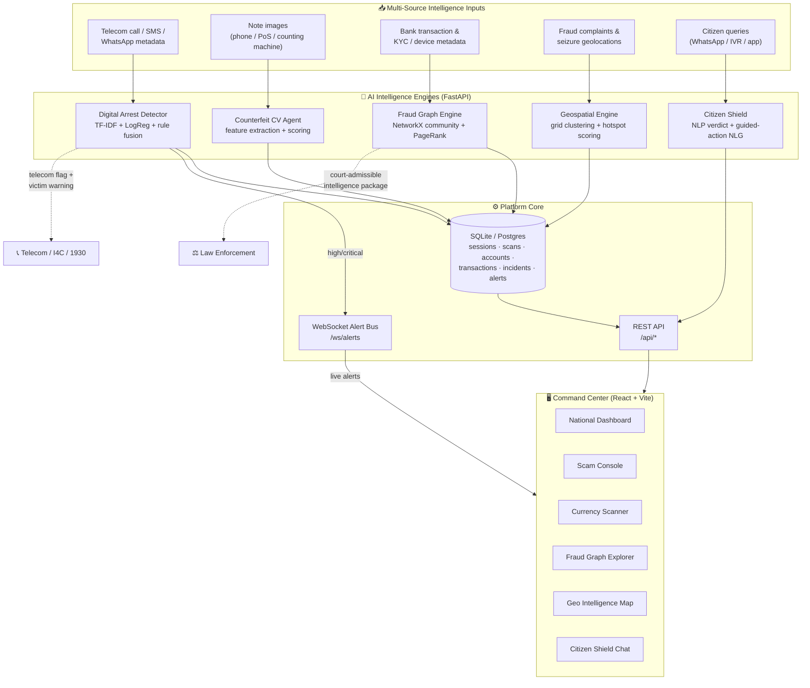
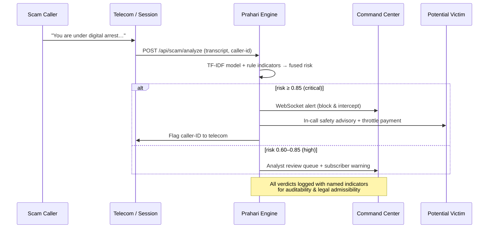

# Prahari — System Architecture

**Prahari** (Sanskrit: *sentinel / guardian*) is an AI-powered Digital Public
Safety Intelligence platform that unifies five threat-neutralisation capabilities
into a single multi-agency command center — shifting law enforcement, banks, and
citizens from *reactive investigation* to *predictive threat neutralisation*.

## High-level architecture

## Data-flow: from contact to neutralisation

## Module design

| Module | Technique | Why it works |
|---|---|---|
| **Digital Arrest Detection** | TF-IDF (1–2 gram) + Logistic Regression trained on labelled scam/legit corpus, fused with a weighted rule layer of 10 named indicator families | Data-driven generalisation *plus* transparent, explainable evidence for every alert (audit requirement). Rules catch novel scripts the model hasn't seen. |
| **Counterfeit Currency Agent** | Pillow/NumPy feature extraction — aspect ratio, dominant colour vs RBI profile, micro-print via high-frequency energy, security-thread band detection, Laplacian sharpness, RBI serial regex | Runs on-device (no GPU), works across all 7 denominations, returns a **per-feature** breakdown a field officer can trust and defend. |
| **Fraud Network Graph** | Directed money-flow graph + shared device/phone linkage, greedy-modularity community detection, PageRank centrality for role inference (kingpin/mule/layer) | Surfaces coordinated rings *before* mass victimisation; auto-generates court-admissible evidence packages traceable to source transactions. |
| **Geospatial Intelligence** | Grid-based spatial clustering (~5.5 km cells), intensity scoring, state-level rollups | Patrol prioritisation, resource deployment, inter-district intelligence sharing — near real-time. |
| **Citizen Fraud Shield** | Reuses the scam NLP verdict, wrapped in guided-action NLG, 1930/NCRB reporting pathway, advisory in 12 Indian languages | Very low false-positive tuning; meets citizens where they are (WhatsApp/IVR/app). |

## Technology stack

- **Backend:** FastAPI, SQLModel (SQLite → Postgres-ready), scikit-learn, NumPy, Pillow, NetworkX, WebSockets
- **Frontend:** React 18, Vite, TailwindCSS, Recharts, Leaflet, react-force-graph
- **Delivery:** Docker Compose (backend + nginx-served SPA), or one-command `./start.sh`

## Auditability & legal admissibility

Every intelligence output is designed to survive scrutiny:
- Scam verdicts carry the **exact matched phrases** and both model + rule scores.
- Currency verdicts list **each security feature** with pass/fail and measured value.
- Fraud packages include a **transaction ledger** where every graph edge maps to a
  timestamped source record, with a chain-of-custody note aligned to BNSS / IT Act.
